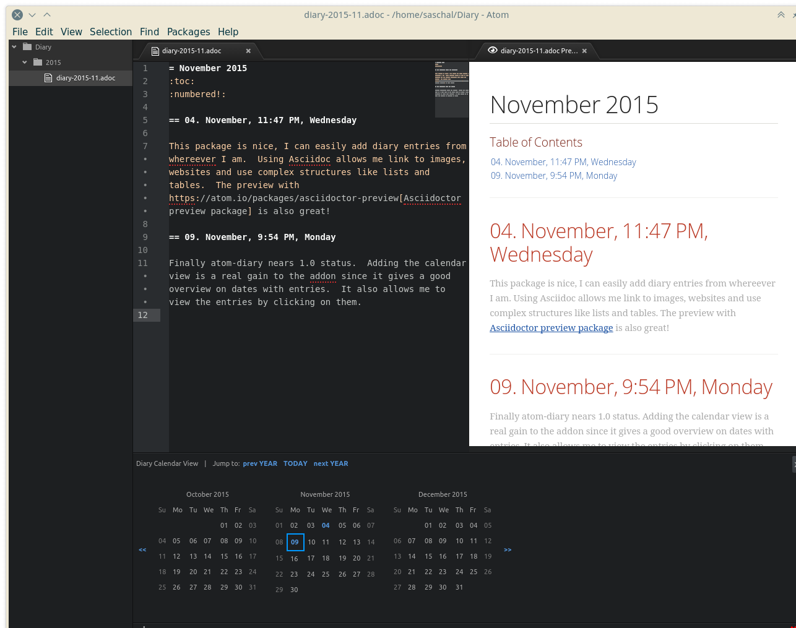

# atom-diary package

This is a simple package to create diary entries using an [Asciidoc](http://asciidoc.org/) or Markdown templates.

There will be one file for each month which contains all entries for this month.
New entries for a day will be appended to the months file.  If there is no file
for the relevant month, it will be created and all files are kept within a configurable directory.

This addon is inspired by my Emacs module [diary-private.el](http://meta-x.de/software/diary-private.el)

You might want to install the [Asciidoctor preview package for Atom](https://atom.io/packages/asciidoctor-preview) for previewing your diary files.

## Features

* Creates month based Asciidoc files for diaries
* User can set a language for the diary files different from the system language
* Automatically creates the diary base directory and one sub-directory per year

## TODO items

* expand on ~/ and $HOME in baseDir configuration
* support Markdown, too
* improve README.md
* include meta Asciidoc/Markdown files to create a printable diary using include::*[]
* add some management functions like sorting of entries
* Improve markup support by using file templates
